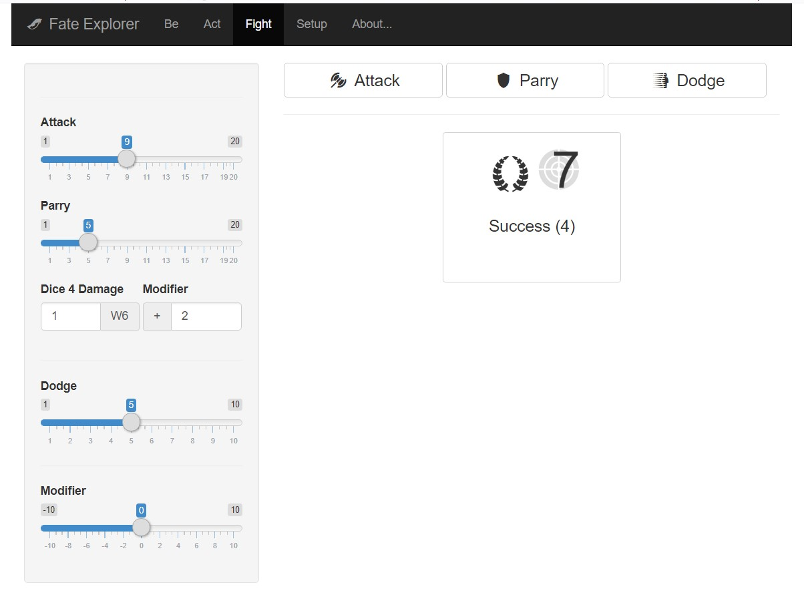
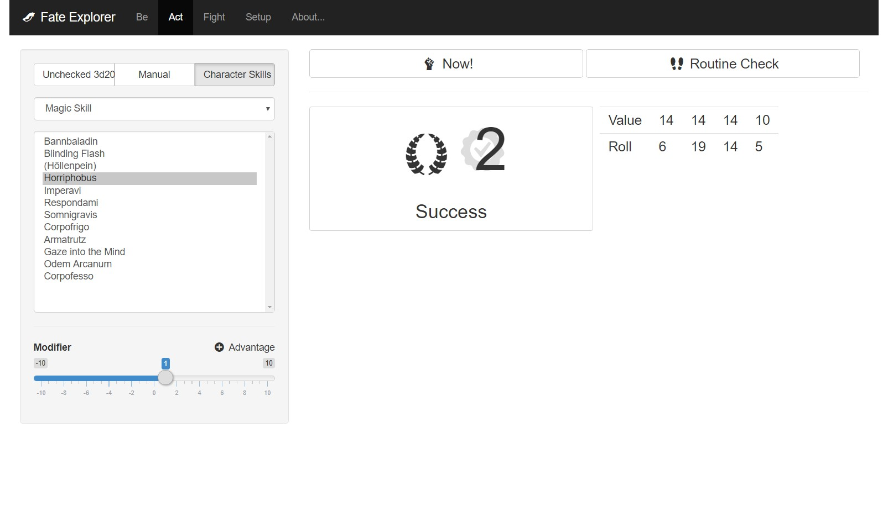

# DSA Fate Explorer

An interface to roll the dice based on the ["dark eye" rule system](https://ulisses-regelwiki.de/index.php/home.html) (version 5) based on [R shiny](https://shiny.rstudio.com/).

## Features

* Ability rolls
* Skill rolls incl. routine checks for mundane, magical or blessed skills
* Combat rolls
* Import [Optolith character sheets](https://optolith.app/en/)
* Display of probabilities for different results
* Bilingual (English and German - can be changed in the code of the script)

## Screenshots

## Limitations at Current State of Development

* Users set the modifiers manually in the UI of the app and roll the dice. The character sheet import does not support special abilities, states, conditions, etc. 
* Language can only be changed in the source code of the script.
* FE is still ignorant of some very pecial rules for weapons; e.g. rolling a 19 with an improvised weapon is actually a botch but FE is not aware of that.
* FE does not know rules that are specific for an individual weapon.