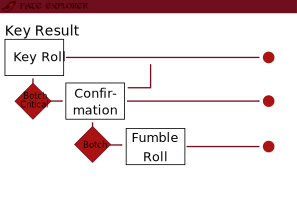

# Implementation Notes on the DSA Fate Explorer

## Localization

FE uses the package ['shiny.i18n'](https://github.com/Appsilon/shiny.i18n). The translations are stored in 'data\lang.json'. The language can be changed by modifying a simple line of code in 'App.R':

```
i18n$set_translation_language("de") 
```

Use "en" instead of "de" and you are in business.

A new translation requires adding several new files, because skills, weapons, ... are not translated by 'shiny.i18n'. They are stored in separate files in the data folder. Each file ends with the language identifier, e.g. 'spells_de' and 'spells_en'.

Support to create new languages is welcome.


## Enums
Fate Explorer uses a number of enums. Since there is no native implementation of enums in R FE uses named atomic vectors to achieve a similar goal. 

The most important enums can be found in 'Rules.R'. Example
```
.WeaponType   <- c(Unarmed = 0L, Melee = 1L, Ranged = 2L, Shield = 3L)
```

This way the enum can be used in several different ways:

* By numeric Id `.CombatAction[2]`
* By string identifier `.CombatAction["Parry"]`
* You can access the label of the enum with `names(.SkillType[YourType])`.
* Check if a variable is a valid instance of the enum with 
`if (! (YourType %in% .SkillType)) stop("Unknown type of skill")`.


Be careful with functions in R that change attributes, most importantly `ifelse()`.


## The Roll Sequence



A DSA 5 roll can have up to three stages:

1. The **key roll** to determine whether a check is successful or not.
   * A 1 indicates a critical success (two 1s in case of a skill check)
   * A 20 is a botch (two 20s in case of a skill check)
2. A botch or critical requires a **confirmation roll** (d20).
3. A fumble roll (2d6) determines the consequences of an action.
   * Rolls against mundane skills and ability checks do not require a fumble roll (consequences are at the game masters discretion).
   * Melee and long-range weapons, blessed and magic skills all have tables to determine the consequences of the sum of 2d6.


